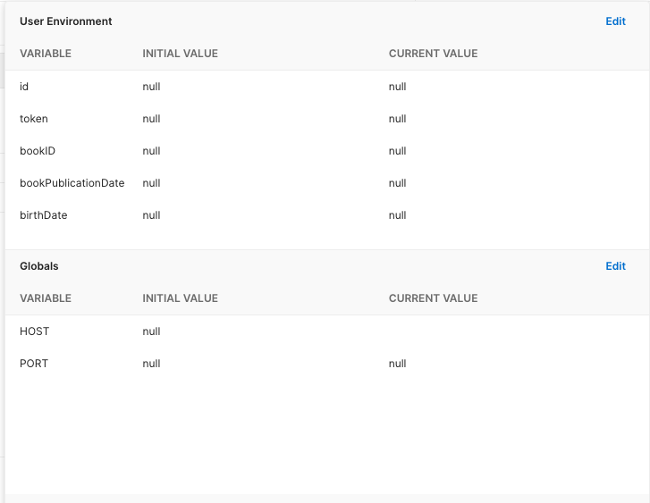

<div id="top"></div>

<h1 align="center">Node.js REST API Example</h1>

<div align="center">
  <p align="center">
    This API example is a basic backend application to test basic API functions.
  </p>
    <a href="https://www.postman.com/almog-gutin/workspace/api-example/overview">View Postman Files</a>
</div>

<!-- TABLE OF CONTENTS -->
<details>
  <summary>Table of Contents</summary>
  <ol>
    <li>
      <a href="#about-the-application">About The Application</a>
      <ul>
        <li><a href="#built-with">Built With</a></li>
      </ul>
    </li>
    <li><a href="#how-to-install">How To Install</a></li>
    <li><a href="#available-scripts">Available Scripts</a></li>
    <li><a href="#postman">Postman</a></li>
  </ol>
</details>

<!-- ABOUT THE APPLICATION -->

## About The Application

This API is a basic example of a REST API backend application.

It is build with Node.js and Express Framework with Javascript. In addition the application's database is MongoDB with the use of an ODM like Mongoose. Additionally the application has basic authentication and authorization functionality with the use of JWT.

In the applicaiton we can add books to the database and users can signip, login, edit, and delete their data. In addition, each user has their own cart where they can store books they want to buy, and checkout if they wish too.

The point of this backend application is to test basic api functions.

<p align="right">(<a href="#top">back to top</a>)</p>

### Built With

-   [Node.js](https://nodejs.org/en/)
-   [Express](https://expressjs.com/)
-   [MongoDB](https://www.mongodb.com/)
-   [Mongoose (ODM)](https://mongoosejs.com/)
-   [JWT](https://www.npmjs.com/package/jsonwebtoken)
-   [Validator.js](https://www.npmjs.com/package/validator)
-   [Cors](https://www.npmjs.com/package/cors)
-   [Days.js](https://day.js.org/)

<p align="right">(<a href="#top">back to top</a>)</p>

<!-- INSTALLATION INSTRUCTIONS -->

## How To Install

**Git clone**

```
git clone https://github.com/almog-gutin/API-Example.git
```

**Instructions**

-   After cloning the the repository run `npm i` in order to install all the dependencies.
-   Fill in all the values of the env variables in `config/dev.env` file so that the application will run properly during development mode.

<p align="right">(<a href="#top">back to top</a>)</p>

<!--  AVAILABLE SCRIPTS -->

## Available Scripts

In the project directory, you can run:

### `npm start`

Runs the app in the production mode.\
However this script is only ment to be run when deploying the application. The application is built, where you need to setup the env variables on the machine that your will be hosting it on or in a webhosting service, unlike in development mode.

### `npm run dev`

Runs the app in the development mode.\
Open localhost on the port you decided on in the env variables to view it in the browser.

The page will reload if you make edits with nodemon.

<p align="right">(<a href="#top">back to top</a>)</p>

<!-- POSTMAN -->

## Postman

Above, there is a link that will take you to the postman files in my postman profile where you can test the api functionality in the browser.

However if you would like to run the files locally on your machine in the postman desktop application, included in the repository, in the `postman` directory all the files so you can import them. In addition you will have to configure env variables in postman so that you will be able to test properly everything.

<div align="center">
  
</div>

<p align="right">(<a href="#top">back to top</a>)</p>
